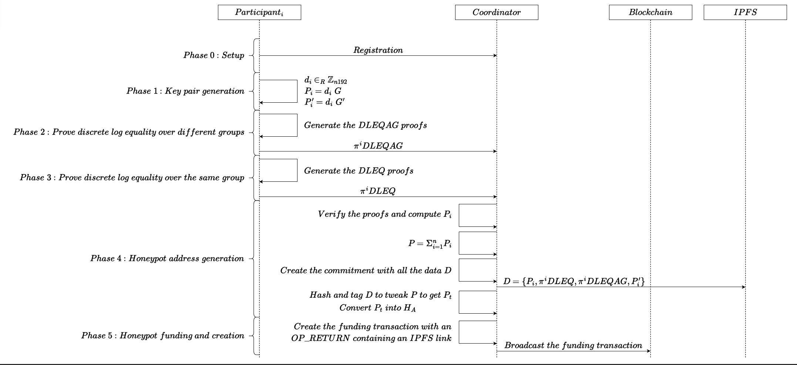

# CAGP: Canary Address Generation Protocol

This repository is a proof of concept implementation of [CAGP](https://eprint.iacr.org/2026/618.pdf), a distributed protocol to create a Bitcoin canary address that is less secure in comparison to Bitcoin's native address' by design. The canary trap serves as a public alert: if its funds are ever spent, it signals that a quantum computer has broken the ECDLP on `secp192r1` (and is approaching the security of Bitcoin's `secp256k1`) with a very high probability. The protocol is implemented in Python and leverages several cryptographic libraries.

---

## Protocol Overview: CAGP

The Canary Address Generation Protocol (CAGP) is a multi-phase, distributed protocol involving `n` participants and a coordinator. The diagram of the steps carried out by each participant/coordinator in the protocol can be seen below: 



### Key Naming Convention

Here we will explain how the naming here in this repo matches the paper. ( do this after cleaning up the repo)

---

## Protocol Phases

### 1. Key Pair and Proof Generation (p1_KeyPairGenerator.py)
- Each participant generates a pair of random Bitcoin private key and derives their corresponding public keys on both `secp192r1` and `secp256k1` curves.
- Outputs are saved in `../outputs/participant/participant_id/keys`.
- Each participant generates the proofs for the DLEQ, DELQAG, and rangeproofs for the generatd keys and stores them in `../outputs/participant/participant_id/proofs`.
### 2. Public Key Aggregation (c2_PublicKeyAggregator.py)
- The coordinator verifies the proofs provided by the participants. 
- The coordinator aggregates the public keys proved valid (from both `secp192r1` and `secp256k1`) via elliptic curve point addition.
### 3. Proof File Generation (c3_generateIPFSFile.py)
- The coordinator generates the file containing all public information of the protocol to be uploaded to the IPFS and saves it as `../outputs/IPFS.json`.
### 4. Honeypot Commitment (c4_HoneypotCommitment.py)
- The coordinators creates the tweaked public key for the taproot address from the aggregated public key on `secp256k1`. 
- It then created the `OP-RETURN` for the funding transaction being the CID of the IPFS file. 
- It initiates the crowdfunding process by publshing the transaction sending some initial funds to the created taproot address from the aggregated public key. 

---

## Implementation Details 

- **Languages/Libraries**: 
  - Python: `bitcoinutils`, `coincurve`, `cryptography`, `tinyec`, `secrets`, `hashlib`, `py-cid`
  - Javascript: `secp256k1`, `bulletproof-js`
- **Directory Structure**:
  - `outputs/participant/participant_#id/keys`: Participant key pairs
  - `outputs/participant/participant_#id/proofs/proof_#publickey.json`: DLEQ and DLEQAG proofs for the keypairs on `secp192r1` and `secp256k1`
  - `outputs/participant/participant_#id/proofs/range_proof_#chunk.json`: Range proofs for each chunk of the commitments.
  - `outputs/IPFS.json`: This file contains all the protocol’s public information, including proofs and public key pairs.

---

## Instructions

The instructions here are just aiming to run the code locally to see the proofs and the format of the commitment transaction. In case you'd like to publish the commitment transaction to `testnet` or `mainnet` please have your WIF, and the outpoint info from your UTXO in the corresponding network ready. 

- To install the python dependencies run the following command in the root directory of the project: 
```bash 
pip3 install -r requirements.txt 
``` 
- To install the javascript dependencies run the following command in the root directory of the project:
```bash 
npm install 
```
  Note that this repository requires Node.js version 16 or higher (preferably version 24).
- To run the protocol locally you first need to set the protocol parameters in the `/setup.json` file. Note that the automatic script only works for when the network is set to `regtest`. Below you can find the description regarding each parameter in the setup: 
  - `max_num_participants`: This is the maximum number of participants allowed in the protocol. Exceeding this value would cause overflow in the aggregation of the public keys in `secp192r1`.
  - `number_of_bits_of_secret_chunks`:  This is the size of the secret value for each chunk in bits ( in the paper it's referred to as `b_x`)
  - `failure_rate`: This is the failure rate for which the prover has to repeat the proof generation process to create a valid `z`. ( in the paper it's referred to as `b_f`)
  - `number_of_bits_of_challenge`: This is the size of the challenge for the proof in bits ( in the paper it's referred to as `b_c`)
  - `number_of_chunks`: The number of chunks that the secret is devided into. 
  - `network`: The network for which the values are going to be created. 
  - `number_of_participants`: The actual number of participants you would like to run the tests for. 

- To run the phases of the protocol according to their order run the following command ( only in case of `regtest` for `testnet` or `mainnet` run the scripts in the order in cagp.sh manually) 
```bash
./cagp.sh
``` 
Note: Depending on your responses, you may need to provide additional information to create the transaction. Please have this information ready beforehand. 
The script does not upload the IPFS file to any public service, so it is your responsibility to do so using a public gateway.
Some examples of public gateways are:
- https://ipfs.io
- https://infura-ipfs.io

---

## References

- [bitcoinutils](https://github.com/karask/python-bitcoin-utils)
- [coincurve](https://github.com/ofek/coincurve)
- [cryptography](https://cryptography.io/)
- [tinyec](https://github.com/alexmgr/tinyec)
